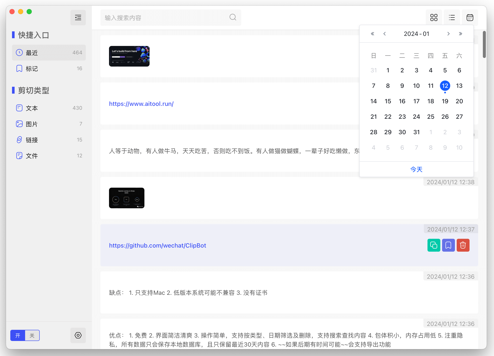
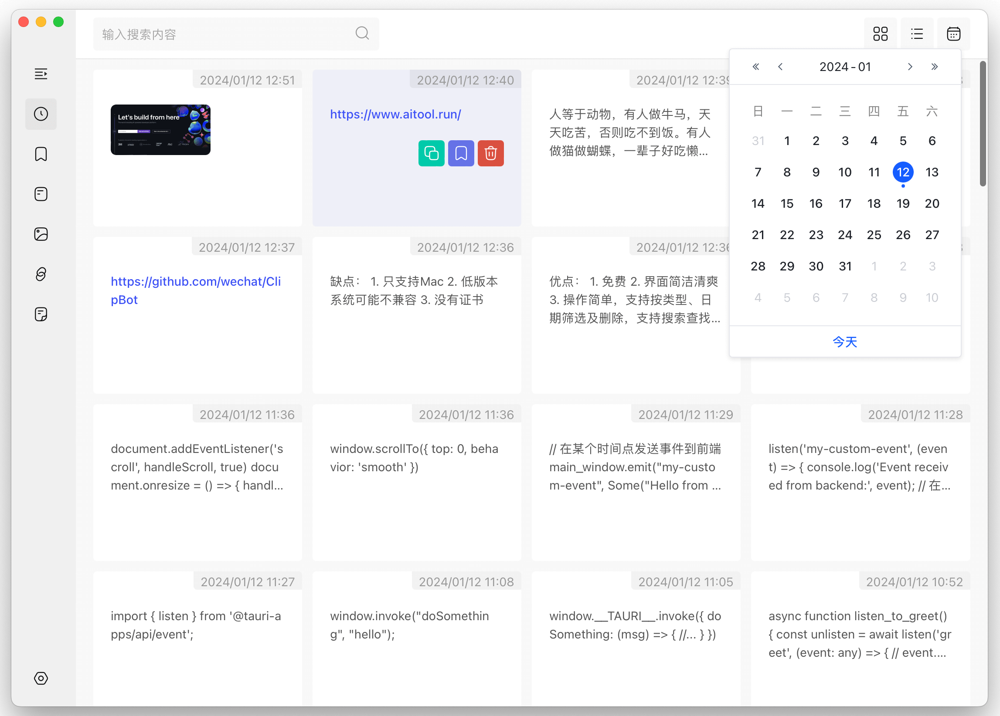

# ClipBot

Clipbot是一个复制粘贴历史管理工具。将您复制到系统剪贴板中的内容汇总记录，并按类型对内容进行分组，便于管理。还贴心提供标记收藏功能，不漏掉您的闪现灵感。

[Download the APP](https://github.com/wechat/ClipBot/releases)

## 演示





### 优点：
1. 免费
2. 界面简洁清爽
3. 操作简单，支持按类型、日期筛选及删除，支持搜索查找内容
4. 包体积小5M左右，内存占用低50M
5. 注重隐私，所有数据只会保存本地数据库，且只保留最近7天内容
6. ~~如果后期有时间可能~~会支持导出功能
7. 版本自动更新，支持基于github actions自动构建打包升级

### 缺点：
1. 只支持Mac
2. 低版本系统可能不兼容
3. 暂时没有证书
4. 当然 也还有很多迭代和优化空间

### 技术栈：
Tauri、Vite 、Vue3、Ts、Pinia、IndexDB、Rust

### Dependent version
```shell
rustc 1.76.0
```

### Project Setup
```shell
pnpm install
```

### Run Project
```shell
pnpm tauri dev
```

### Run Project
```shell
pnpm tauri build
```

[Download the APP](https://github.com/wechat/ClipBot/releases)


### 鼓励作者

